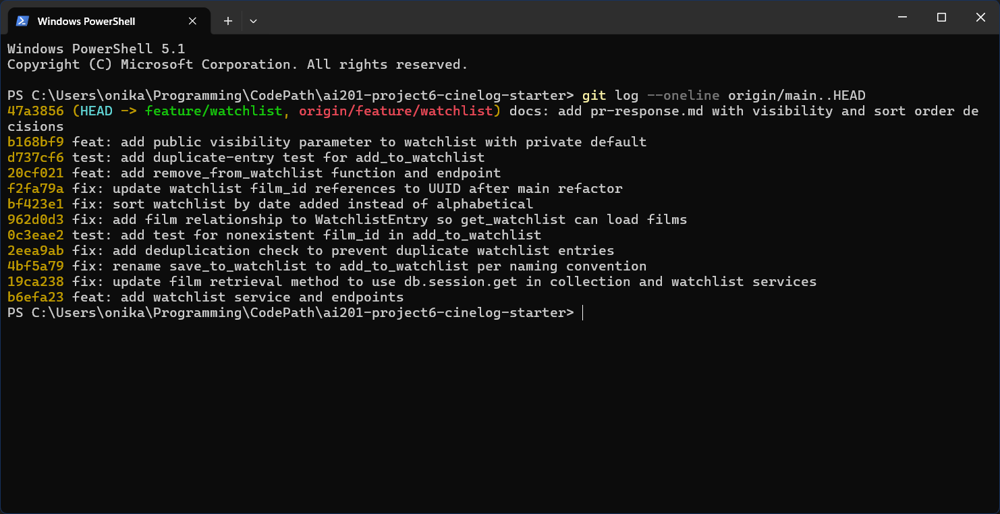

# PR Response Doc — CineLog Watchlist Feature

## AI Usage

I used an AI coding assistant (Claude Code) throughout this project, but in a directed way —
for orientation, verification, and as a sounding board — while keeping the design decisions and
arguments my own. Specific uses:

- **Codebase orientation.** Before reading the review comments, I had the assistant walk me
  through `models.py`, `add_to_collection()` in `collection_service.py`, and the test in
  `test_collection.py`, in small pieces. I used this to understand the existing "check film
  exists → check for duplicate → save" pattern and the fixture style before writing my own
  versions. I verified its explanations against the actual code rather than taking them on
  faith.
- **Implementing against existing patterns.** For the deduplication fix (Comment 2) and the
  test (Comment 3), I used the assistant to confirm how `add_to_collection()` and the existing
  tests work, then applied the same pattern to the watchlist. I did not have it invent the
  deduplication logic from scratch — it mirrors the collection code.
- **Verification and hygiene.** I used it to run the test suite after each change, to search the
  codebase for leftover references (e.g. confirming every `save_to_watchlist` call site was
  renamed, and that no integer film-ID references remained after the UUID rebase), and to check
  that my commit messages followed conventional-commit format.
- **Catching a bug.** While verifying the sort-order change (Comment 5), running the code
  surfaced a pre-existing bug — `get_watchlist()` referenced `entry.film`, but `WatchlistEntry`
  had no relationship to `Film`. I fixed it by adding the relationship, mirroring how
  `CollectionEntry` gets its `film`.
- **Stress-testing my design arguments (Comments 4 and 5).** This is where I was careful to do
  my own reasoning. For **Comment 4 (visibility)**, the argument is mine: I used my own
  Goodreads experience — that I leave certain books off my public "want to read" list because
  I'm known in the horror community but also read queer romance, and that a public-by-default
  list could out a closeted user. The assistant acted as a sounding board: it reflected my
  argument back, helped me name the tradeoff (a private default can make the app look empty and
  puts the sharing burden on users), and pointed out that the `public` flag already lives
  per-entry so my "per-film switch" idea was buildable. I asked it what a reviewer might push
  back on, and the empty-app tradeoff is what I incorporated. For **Comment 5 (sort order)**,
  the position is mine too: I concede date-added as the default but push for sortable views
  because I personally browse my watchlist by a film's *release year*, which neither option
  covers. The assistant helped me organize the argument and check I was engaging the reviewer's
  point directly, but the reasoning and the examples are my own — not a generic AI-written
  argument.

## Comment 1 — Rename
**What I did:** Renamed `save_to_watchlist()` to `add_to_watchlist()` so it follows
the project's `verb_to_noun` naming convention (matching `add_to_collection()`). The name
appeared in three places: the function definition in `services/watchlist_service.py`, and
both the import and the call site in `routes/watchlist/watchlist.py`.

**How I verified:** Before editing, I ran a project-wide search for `save_to_watchlist`
(`grep -rn save_to_watchlist`) to find every call site — it returned exactly three hits in
the two files above, confirming there were no other callers hiding elsewhere. After renaming
all three, I re-ran the same search and it returned zero matches, proving nothing was missed.
I then ran `pytest tests/` and all tests passed, confirming the rename didn't break anything.

## Comment 2 — Deduplication
**What I did:** Added a duplicate check to `add_to_watchlist()`, following the same pattern
`add_to_collection()` already uses in `services/collection_service.py`. Concretely: I added a
new `AlreadyInWatchlistError` exception (the twin of `AlreadyInCollectionError`), and before
creating a new `WatchlistEntry` the function now queries for an existing entry with the same
`user_id` and `film_id` (`WatchlistEntry.query.filter_by(...).first()`). If one is found, it
raises `AlreadyInWatchlistError` instead of inserting a second row. I also updated the route
(`routes/watchlist/watchlist.py`) to catch this and return a **409 Conflict**, and to catch
`FilmNotFoundError` and return **404** — mirroring how the collection route handles the same
two cases, so the endpoint no longer crashes with a 500 on a bad or duplicate request.

I based this on the existing `add_to_collection()` pattern: it checks the film exists first,
then checks for an existing entry, then commits — I copied that "check, check, then act" shape.

**How I verified:** I wrote a small script that adds a film to a watchlist twice. The first
add succeeded; the second raised `AlreadyInWatchlistError` (message: "Film '1' is already on
this user's watchlist"), confirming no duplicate row is created. The full existing test suite
still passes, and the app imports cleanly. (A dedicated automated test follows in Comment 3's
work / the stretch tests.)

## Comment 3 — Missing test
**What I did:** Created `tests/test_watchlist.py` and added
`test_add_to_watchlist_nonexistent_film_raises`, which passes a `film_id` that doesn't exist
in the database and asserts that `add_to_watchlist()` raises `FilmNotFoundError`. I modeled it
directly on `test_add_to_collection_nonexistent_film_raises` in `tests/test_collection.py` —
same `app` / `sample_user` fixtures, same `with pytest.raises(...)` assertion structure. I
reused the collection test's fixture pattern (in-memory SQLite database, a seeded test user).

**How I verified:** Ran `pytest tests/test_watchlist.py -v` — the new test passed. Then ran the
full suite (`pytest tests/`) — all 5 tests pass (the 4 original collection tests plus this new
one). The test targets the required case (a nonexistent `film_id`), matching what the reviewer
asked for.

## Comment 4 — Default visibility
**My position:** Watchlists should default to **private**. Each film added to a watchlist
should be private unless the user chooses to make that specific film public. So the default
value of `public` should be `False`, not `True`.

**Reasoning:** A watchlist is fundamentally different from a collection of films you've already
watched and rated. A rating is a finished statement — "I watched this, here's my verdict." A
watchlist is intent and curiosity: it shows what you're drawn to *before* you've decided how
you feel about it, which is more vulnerable and easier to misread.

I'll use my own Goodreads profile as an example. I'm comfortable with my "want to read" list
being public in general, but there are books I deliberately leave *off* it because I don't want
to announce that I want to read them yet. I'm heavily involved in the horror community, but I
have a huge soft spot for romance — specifically queer romance. Making a want-to-read public
can push you "off-brand" with the followers you've built, and there's a deeper problem: what
about a closeted person? A public-by-default watchlist could out someone to their community
through a single film they saved — a queer film, a recovery documentary, anything tied to
identity they aren't ready to share. A default should never be the thing that exposes a user.
CineLog is a taste-driven community app (the same social dynamics as Goodreads or Letterboxd),
so private-by-default protects users from involuntary disclosure while still letting them opt
in to sharing on their own terms.

**Tradeoff acknowledged:** Public-by-default is better for making the app feel *alive*. If
every watchlist is private, a new or small CineLog can look empty and unused, because none of
the community's "want to watch" activity is visible — and it puts the burden on each user to go
turn sharing on before they get any social payoff. Public-by-default removes that friction and
fuels discovery (you find films through other people's lists).

I think the strongest resolution keeps the safety floor without giving up discovery: **default
each film to private, but let users flip individual films to public.** Because the `public`
flag lives on each `WatchlistEntry` (per film, not per user), the data model already supports
this — a user can keep their queer-romance picks private while making the horror films they're
proud of public. Engaged users can still populate public discovery and keep the app feeling
active; users who want privacy are protected by default. (A per-film visibility toggle endpoint
that exposes this is implemented / discussed in the stretch features section.)

## Comment 5 — Sort order
**My position:** I agree with the maintainer — the default should change from alphabetical to
**date-added (newest first)**. But I'd go one step further: the watchlist should ideally be
**sortable**, with date-added as the default and other options (release year, alphabetical)
available, because the single best default still doesn't cover how people actually browse a
watchlist.

**Reasoning:** Alphabetical order really only helps in one situation: when you already know the
exact title you're looking for and want to jump to it. But that's a *collection* behavior —
"did I already log Dune?" On a watchlist you're not looking something up, you're deciding what
to watch next, so ordering by title doesn't match the task. Nobody opens their watchlist
thinking "I want something in the M-to-P range." Date-added is more useful as a default because
the film you saved most recently is usually the one you're most itching to watch — you just
heard about it, so it should be easy to find at the top.

Where I push the conversation further: when *I* browse my own watchlist, I'm usually looking
for a film by its **release date** (the movie's year — e.g. I'm in the mood for something from
the 70s, or something brand new). That's a third axis that neither alphabetical nor date-added
gives you. So the honest answer is that no single hardcoded order serves everyone — the real
improvement is letting users sort the watchlist (date-added by default, plus release-year and
alphabetical). That keeps the sensible default the maintainer asked for while actually serving
mood-based browsing.

**Engagement with reviewer's point:** The maintainer said "Most users want to see what they
added recently," and I think that's correct as a *default* — I'm conceding it, and with a
reason (alphabetical optimizes for known-item lookup, which is a collection behavior, not a
watchlist behavior). I'm not just deferring to their preference; I'm agreeing with the
underlying logic and then extending it: recency is the right default, but the deeper user need
(browsing by when a film came out) points toward making sort order a user choice rather than a
fixed rule. So: change the default to date-added now, and treat sortable views as a natural
follow-up.

**Implementation note:** I changed `get_watchlist()` to sort by
`WatchlistEntry.date_added.desc()` (newest first), matching `get_collection()`. While verifying
this, I found a pre-existing bug: `get_watchlist()` reads `entry.film`, but `WatchlistEntry`
had no relationship to `Film`, so viewing a watchlist would crash — the feature simply had no
test exercising it. I added `film = db.relationship("Film")` to the model (mirroring how
`CollectionEntry` gets its `film`) and committed that as a separate fix. I verified the sort by
adding two films at different times and confirming the most recently added one comes back
first.

## Comment 6 — Rebase
**What conflicted:** While my PR was open, a refactor merged to `main` that changed film IDs
from integers to UUIDs. That refactor rewrote `models.py`: it changed `Film.id` (and
`CollectionEntry.film_id`) to `db.String(36)` UUIDs and, in the process, removed the
`WatchlistEntry` model entirely. My branch still defined `WatchlistEntry` with an **integer**
`film_id`. When I ran `git rebase origin/main`, git stopped on a conflict in `models.py`: the
new `main` side had *deleted* `WatchlistEntry`, while my side still added it with an integer
`film_id`. Git couldn't reconcile "delete" vs "keep-and-modify," so it asked me to resolve it.

**How I resolved it:** I kept the `WatchlistEntry` model (the watchlist feature needs it) but
updated it to match the refactor — I changed `film_id` from `db.Integer` to
`db.String(36), db.ForeignKey("film.id")`, exactly like `CollectionEntry.film_id` now is. I
also updated the remaining integer references in the watchlist code and docs: the `film_id (int)`
docstring in `add_to_watchlist()`, the `Body: { "film_id": <int> }` comment in the route, and
the fake ID in my test (now a UUID string instead of `999999`).

**How I verified no conflict remains:** I searched the files for leftover conflict markers
(`<<<<<<<`, `=======`, `>>>>>>>`) and found none, then ran `git add models.py` and
`git rebase --continue` to finish. After the rebase I confirmed: (1) the app imports cleanly
(`WatchlistEntry` loads against the UUID schema), (2) all 5 tests pass, (3) `git log` shows a
linear history with **zero merge commits** (`git log --merges origin/main..HEAD` returns
nothing), and (4) a search for integer references (`<int>`, `(int)`, `pre-refactor`) in the
watchlist code returns nothing.

## Stretch Features

### Stretch — `remove_from_watchlist()`
**What I did:** Added `remove_from_watchlist(user_id, film_id)` to
`services/watchlist_service.py`, following the same pattern as `remove_from_collection()`. It
looks up the user's watchlist entry for that film; if none exists it raises a new
`NotInWatchlistError` (the twin of `NotInCollectionError`), otherwise it deletes the entry,
commits, and returns `True`. I also added a `DELETE /watchlist/<user_id>/remove` endpoint that
mirrors the collection remove route (returns 200 on success, 404 with `NotInWatchlistError`).
The function name follows the project's `verb_from_noun` convention (`remove_from_collection` →
`remove_from_watchlist`).

**What it does when the film isn't on the watchlist:** it raises `NotInWatchlistError` instead
of silently doing nothing, so a caller trying to remove something that was never there gets a
clear 404 rather than a false success.

**Test:** I added two tests in `tests/test_watchlist.py` — `test_remove_from_watchlist_removes_entry`
(confirms the entry is deleted and the function returns True) and
`test_remove_from_watchlist_not_present_raises` (confirms removing a film that isn't on the list
raises `NotInWatchlistError`). All 7 tests pass.

### Stretch — Second test
**What I did:** Added `test_add_to_watchlist_duplicate_raises` to `tests/test_watchlist.py`,
beyond the nonexistent-film test required by Comment 3.

**Edge case I chose and why:** the duplicate-add case. Comment 2 added deduplication logic to
`add_to_watchlist()`, but there was no automated test protecting it — so this test adds the same
film twice, asserts `AlreadyInWatchlistError` is raised, and confirms only one entry exists in
the database. I chose it because it locks in the Comment 2 behavior against future regressions,
and because the project's `CONTRIBUTING.md` explicitly recommends a duplicate/conflict test for
every service function (alongside a happy-path and nonexistent-ID test).

### Stretch — Visibility toggle
**What I did:** Added a `public` parameter to `add_to_watchlist()` and its
`POST /watchlist/<user_id>/add` endpoint, and changed the `WatchlistEntry.public` column
default from `True` to `False`. This implements my Comment 4 decision in code: watchlists are
now **private by default**, and a caller can make a specific film public by passing
`public: true`.

**How the parameter works / what the default is:** `add_to_watchlist(user_id, film_id,
public=False)` — if `public` is omitted, the entry is created private (`public=False`). The
endpoint reads it from the request body with `data.get("public", False)`, so a request with no
`public` field also defaults to private.

**How a caller would use it:**
- Private (default): `POST /watchlist/<user_id>/add` with body `{ "film_id": "<uuid>" }`
- Public: `POST /watchlist/<user_id>/add` with body `{ "film_id": "<uuid>", "public": true }`

**Test:** Added `test_add_to_watchlist_defaults_private` (confirms a film added without a
visibility value is private) and `test_add_to_watchlist_public_when_requested` (confirms
`public=True` makes the entry public). All 10 tests pass.

## PR Description

### What the watchlist feature does
This PR adds a **watchlist** to CineLog — a list of films a user wants to watch later, separate
from their collection (films they've already watched and rated). Users can add a film to their
watchlist, remove one, and view their whole watchlist. It follows the existing collection
feature's patterns: a `WatchlistEntry` model, service functions in
`services/watchlist_service.py`, and REST endpoints under `/watchlist`. Adding a film that
doesn't exist returns 404, and adding a film that's already on the list returns 409 instead of
creating a duplicate.

**Endpoints:**
- `GET /watchlist/<user_id>` — view a user's watchlist (newest-added first)
- `POST /watchlist/<user_id>/add` — add a film (body: `{ "film_id": "<uuid>", "public": false }`)
- `DELETE /watchlist/<user_id>/remove` — remove a film (body: `{ "film_id": "<uuid>" }`)

### Design decisions
1. **Default visibility: private.** New watchlist entries default to `public=False`. A watchlist
   signals intent/curiosity rather than an endorsement, and a public-by-default list could
   expose or "out" a user through a single saved film. Users can opt individual films into being
   public by passing `public: true`. (Full reasoning in Comment 4 above.)
2. **Sort order: date-added (newest first).** Changed from the original alphabetical order.
   Alphabetical only helps when you already know a title (a collection lookup); on a watchlist
   you're browsing what to watch next, so surfacing what you most recently added is more useful.
   (Full reasoning in Comment 5 above.)

### How to manually test the feature
These steps assume the app is running (`python app.py`) at `http://localhost:5000`. You need a
valid `user_id` and `film_id` (UUIDs) from the seeded database.

1. **Add a film to the watchlist:**
   `POST /watchlist/<user_id>/add` with body `{ "film_id": "<uuid>" }` → expect `201` and a JSON
   entry with `"public": false`.
2. **View the watchlist:**
   `GET /watchlist/<user_id>` → expect a JSON list containing that film.
3. **Add the same film again (deduplication):**
   repeat step 1 → expect `409` with an "already on this user's watchlist" error.
4. **Add a nonexistent film:**
   `POST /watchlist/<user_id>/add` with a made-up `film_id` → expect `404`.
5. **Add a film as public (visibility toggle):**
   `POST /watchlist/<user_id>/add` with body `{ "film_id": "<uuid>", "public": true }` → expect
   `201` with `"public": true`.
6. **Add two films at different times, then view (sort order):**
   `GET /watchlist/<user_id>` → the most recently added film appears first.
7. **Remove a film:**
   `DELETE /watchlist/<user_id>/remove` with body `{ "film_id": "<uuid>" }` → expect `200`;
   removing a film not on the list → expect `404`.
8. **Run the test suite:** `pytest tests/ -v` → all 10 tests pass.

### git log (final history)



<!-- Text version below for reference (all conventional, no merge commits). -->
```
docs: add pr-response.md with visibility and sort order decisions
feat: add public visibility parameter to watchlist with private default
test: add duplicate-entry test for add_to_watchlist
feat: add remove_from_watchlist function and endpoint
fix: update watchlist film_id references to UUID after main refactor
fix: sort watchlist by date added instead of alphabetical
fix: add film relationship to WatchlistEntry so get_watchlist can load films
test: add test for nonexistent film_id in add_to_watchlist
fix: add deduplication check to prevent duplicate watchlist entries
fix: rename save_to_watchlist to add_to_watchlist per naming convention
fix: update film retrieval method to use db.session.get in collection and watchlist services
feat: add watchlist service and endpoints
```
